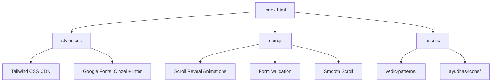

# Build Narayana Consulting Services LLP Website

## Architecture Overview

Create a static website with separate HTML, CSS, and JS files optimized for GitHub Pages deployment. The site will feature a modern single-page design with smooth scroll animations and a glassmorphism navigation bar.




## File Structure

Create the following file structure in `[/Users/mahendrabagul/DevEnv/narayana-consulting-services-llp/repos/narayanaconsultingservicesllp.github.io](/Users/mahendrabagul/DevEnv/narayana-consulting-services-llp/repos/narayanaconsultingservicesllp.github.io)`:

```
narayanaconsultingservicesllp.github.io/
├── index.html          # Main HTML structure
├── styles.css          # Custom styles + Tailwind overrides
├── main.js             # JavaScript for animations & interactions
└── assets/
    ├── logo.png        # Company logo (provided)
    ├── vedic-patterns/ # SVG patterns (Sri Yantra, sacred geometry)
    └── ayudhas/        # Four Ayudhas icons (Shankh, Chakra, Gada, Padma)
```

## Color Palette

- **Primary (Bhagva)**: `#FF6B35` (Saffron/Orange for CTAs)
- **Secondary (Deep Blue)**: `#1A3A52` (Cosmic Narayana blue)
- **Accent (Gold)**: `#D4AF37` (Detailing and highlights)
- **Background**: `#FFFFFF` (Clean white base)
- **Text**: `#2C3E50` (Dark gray for readability)
- **Glassmorphism Nav**: `rgba(26, 58, 82, 0.8)` with backdrop blur

## Section-by-Section Implementation

### 1. Hero Section

- Full viewport height with gradient background (Deep Blue → lighter blue)
- **Company logo prominently displayed at the top or center**
- Cinzel font for "End-to-End Solutions, Divine Excellence"
- Subtle Sri Yantra pattern as watermark background
- Bhagva-colored CTA button with hover animation
- Downward scroll indicator

### 2. Philosophy Section (The Four Ayudhas)

- Grid layout (2x2 on desktop, 1 column on mobile)
- Each card features:
  - Custom SVG icon for Shankh/Chakra/Gada/Padma
  - Gold accent border on hover
  - Title in Cinzel, description in Inter
  - Scroll-reveal animation (fade-in + slide-up)
- Vedic geometry patterns in card backgrounds

### 3. Services Section

- Three-column grid (stacks on mobile)
- Cards with glassmorphism effect
- Icons/illustrations for Consulting, Full-Stack Development, Cloud Transformation
- Hover effects with gold accent borders

### 4. About Section

- Clean two-column layout (text + visual element)
- Mention Nashik roots and global standards
- Include company values/approach

### 5. Contact Section

- Centered lead generation form
- Fields: Name, Email, Company, Message
- Form validation in JavaScript
- **Mailto link to: [narayanaconsultingservicesllp@gmail.com](mailto:narayanaconsultingservicesllp@gmail.com)**
- Gold submit button with hover effect
- Display company email for direct contact

### 6. Sticky Navigation

- Glassmorphism effect: `backdrop-filter: blur(10px)`
- Deep Blue background with transparency
- **Company logo on the left side of the navigation**
- Smooth scroll to sections on link click
- Nav links on right: Philosophy, Services, About, Contact
- Mobile hamburger menu

## Technical Implementation Details

### HTML Structure (`[index.html](/Users/mahendrabagul/DevEnv/narayana-consulting-services-llp/repos/narayanaconsultingservicesllp.github.io/index.html)`)

- Semantic HTML5 structure
- SEO meta tags (title, description, keywords)
- Open Graph tags for social sharing
- Google Fonts: Cinzel (headings) + Inter (body)
- Tailwind CSS via CDN
- Structured sections with IDs for navigation

### CSS (`[styles.css](/Users/mahendrabagul/DevEnv/narayana-consulting-services-llp/repos/narayanaconsultingservicesllp.github.io/styles.css)`)

- Custom CSS variables for color palette
- Tailwind utility overrides
- Glassmorphism navigation styles
- Vedic pattern backgrounds (SVG data URIs or external files)
- Responsive breakpoints
- Smooth transitions and hover effects
- Scroll-reveal animation keyframes

### JavaScript (`[main.js](/Users/mahendrabagul/DevEnv/narayana-consulting-services-llp/repos/narayanaconsultingservicesllp.github.io/main.js)`)

- Intersection Observer for scroll-reveal animations
- Smooth scroll behavior for navigation links
- Sticky nav activation on scroll
- Form validation (email format, required fields)
- Mobile menu toggle
- Mailto link generation: `mailto:narayanaconsultingservicesllp@gmail.com` with form data in body

### Assets

**Company Logo**: 

- Source: `/Users/mahendrabagul/.cursor/projects/Users-mahendrabagul-DevEnv-lingk-repos-transformerv2-launcher/assets/Company-logo-5ff66fb5-2ccf-4b8f-a43b-e550dc295e02.png`
- Copy to: `assets/logo.png`
- Usage: Navigation bar (small version) + Hero section (larger version)
- Optimized for web display with proper sizing

**SVG Icons for Four Ayudhas**: Create simplified, modern SVG representations:

- **Shankh (Conch)**: Spiral shell design
- **Chakra (Discus)**: Circular wheel with spokes
- **Gada (Mace)**: Geometric club shape
- **Padma (Lotus)**: Stylized lotus flower

**Vedic Patterns**: Subtle SVG backgrounds:

- Sri Yantra geometric pattern
- Sacred geometry (circles, triangles)
- Low opacity for subtlety

**Contact Information**:

- Email: [narayanaconsultingservicesllp@gmail.com](mailto:narayanaconsultingservicesllp@gmail.com)
- Display in footer and contact section

## Performance Optimizations

1. **Lazy loading**: Images load only when in viewport
2. **Minification**: CSS/JS will be minified for production
3. **CDN**: Tailwind and fonts from CDN for fast loading
4. **SVG icons**: Vector graphics for crisp display at any size
5. **Debounced scroll listeners**: Optimize scroll event performance
6. **Critical CSS inline**: Consider inlining critical above-the-fold CSS

## Responsive Design Breakpoints

- **Mobile**: < 640px (single column, hamburger menu)
- **Tablet**: 640px - 1024px (adjusted grids)
- **Desktop**: > 1024px (full multi-column layouts)

## Deployment

The site will be ready for GitHub Pages deployment:

1. Push files to the `main` branch
2. GitHub Pages will serve from root directory
3. Site accessible at `https://narayanaconsultingservicesllp.github.io`

## Browser Compatibility

Target modern browsers with graceful degradation:

- Chrome/Edge (latest 2 versions)
- Firefox (latest 2 versions)
- Safari (latest 2 versions)
- Mobile browsers (iOS Safari, Chrome Mobile)
- Fallbacks for backdrop-filter (glassmorphism)

